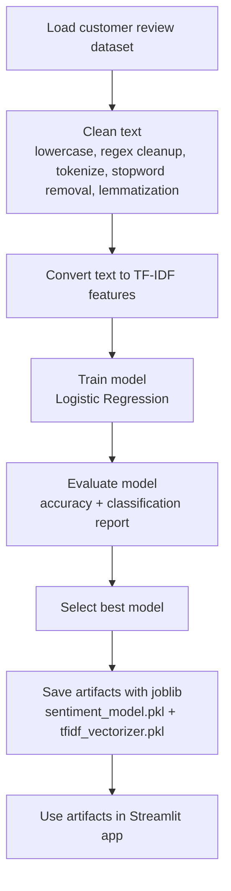
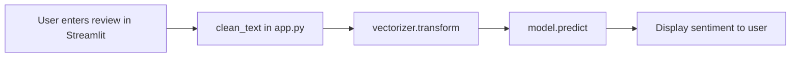

# Customer Review Sentiment Analyzer

A Streamlit-based NLP application that predicts customer review sentiment using a trained scikit-learn model and TF-IDF features.

## Project Overview

This project includes:
- A training and experimentation notebook: `CUSTOMER_REVIEW_SENTIMENT_ANALYZER.ipynb`
- A deployed Streamlit app: `app.py`
- Pre-trained artifacts:
  - `sentiment_model.pkl`
  - `tfidf_vectorizer.pkl`

The app accepts a review, preprocesses text, converts it into TF-IDF vectors, and predicts sentiment (`Positive`, `Negative`, or `Neutral`).

## Tech Stack

| Layer | Tools / Libraries |
|---|---|
| UI / App | Streamlit |
| ML / NLP | scikit-learn, NLTK |
| Data & Analysis (notebook) | pandas, numpy, matplotlib, seaborn |
| Model Serialization | joblib |
| Language | Python |

## Repository Structure

```text
.
├── app.py
├── CUSTOMER_REVIEW_SENTIMENT_ANALYZER.ipynb
├── sentiment_model.pkl
├── tfidf_vectorizer.pkl
└── README.md
```

## Workflow

### 1) Training & Artifact Creation Workflow



### 2) App Inference Workflow



## How the App Works

1. On startup, the app downloads required NLTK resources (`stopwords`, `punkt_tab`, `wordnet`, `omw-1.4`).
2. It loads the trained model and vectorizer from `.pkl` files.
3. User submits review text.
4. `clean_text()` preprocesses the input:
   - lowercasing
   - removing non-alphabetic characters
   - tokenizing
   - stopword removal
   - lemmatization
5. Cleaned text is vectorized via TF-IDF.
6. Model predicts sentiment and Streamlit renders result:
   - ✅ Positive
   - ❌ Negative
   - ➖ Neutral

## Setup & Run

### Prerequisites
- Python 3.9+ recommended
- pip

### Install dependencies

```bash
pip install streamlit scikit-learn nltk joblib pandas numpy matplotlib seaborn
```

### Run the app

```bash
streamlit run app.py
```

Then open the local URL shown in your terminal (usually `http://localhost:8501`).

## Notes

- The repository currently stores pre-trained artifacts directly (`.pkl` files), so retraining is optional for running the app.
- If you retrain the model in the notebook, overwrite `sentiment_model.pkl` and `tfidf_vectorizer.pkl` so the app uses updated artifacts.
